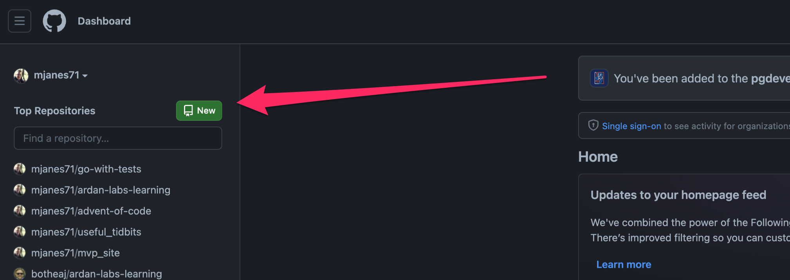
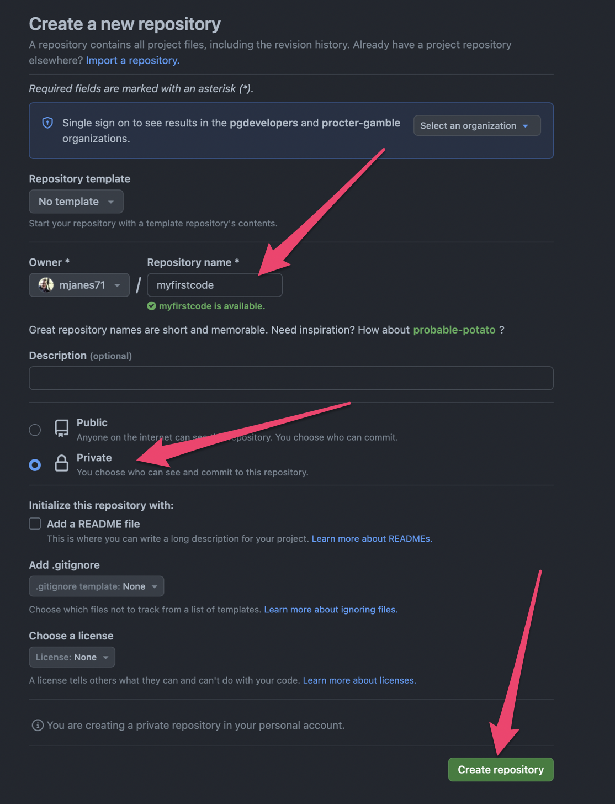
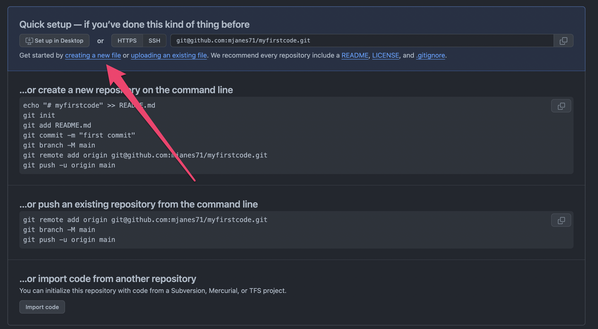
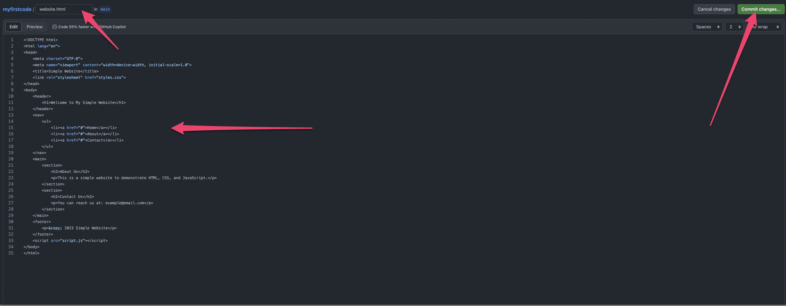
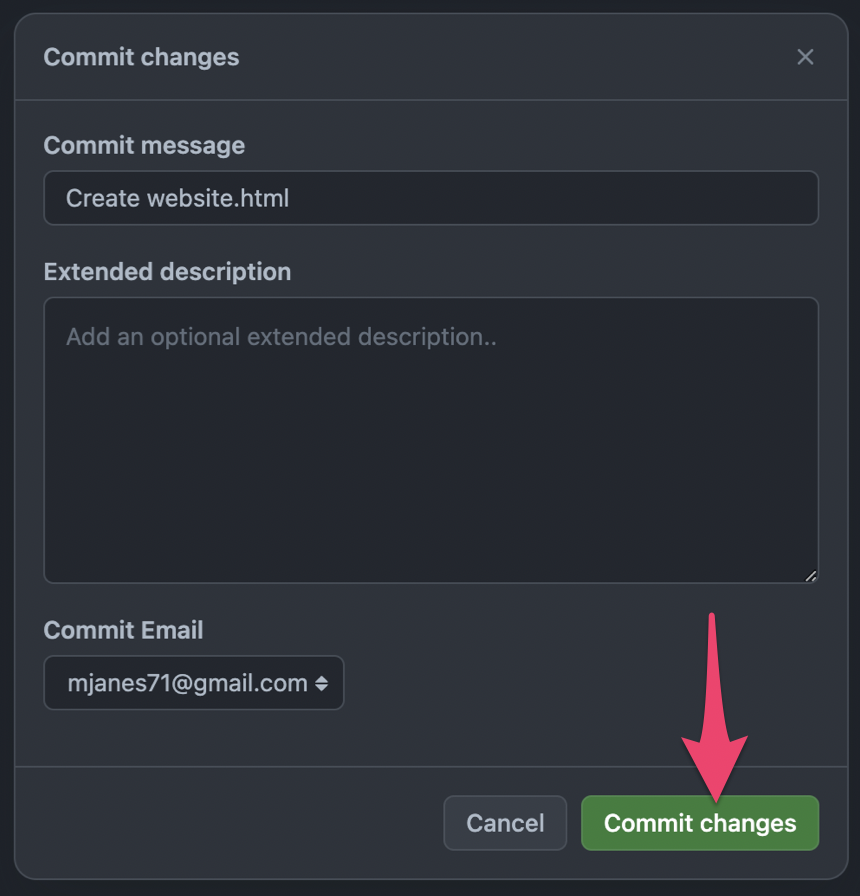
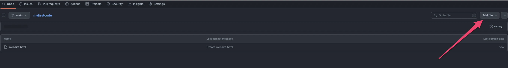

# Github

Github is a place where you can keep copies of the code you write so it's easy for you to access and easy to share with others. A repository is like a folder where all the code for one project can live.

To get started, go to [https://github.com/](https://github.com/)

## Create an account

## Create a repo

## Give the repo a name

## Create a new file

## Add your HTML code to that file and give it a name

## Commit your file

## Add another new file so you can add your CSS

