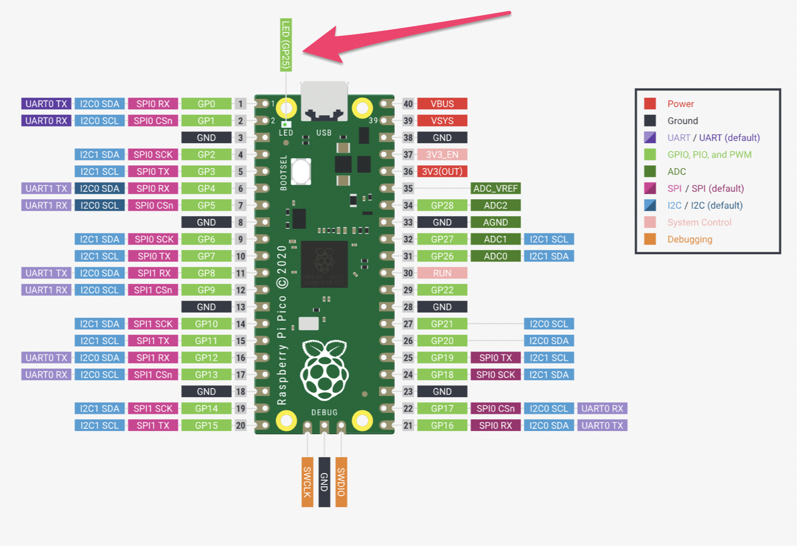

# Pico Pins
The Raspberry Pi Pico has 40 pins along the side of the device that can be used to attach different sensors. Each pin supports different types of attachments, and a diagram is included if you ever want to dig deeper


Sautered directly onto the Pico is an LED light that can be controlled by accessing pin #25. 

You will need one package to write code for that pin called "machine." In MicroPython, the machine package is commonly used for hardware-related operations.
```python
import machine
```

Next, you'll need a variable for your led pin. Maybe, led_pin? And you'll use a tool from the machine package called `Pin` to say you want to control pin 25.
```python
led_pin = machine.Pin(25, machine.Pin.OUT)
```

To turn the light on, try out the toggle function
```python
led_pin.toggle()
```